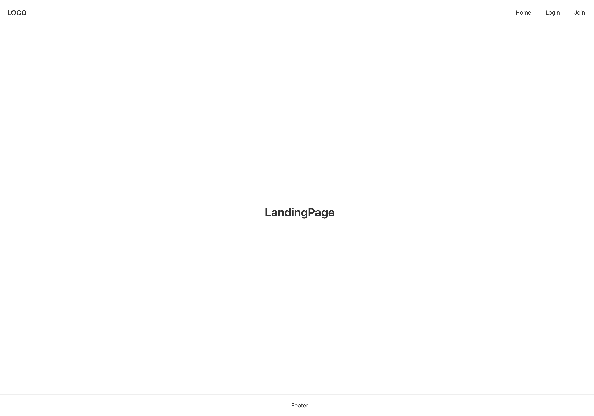

# node-react-user-sample
> Node.js and React.js User Sample.

<br>

## Development Environment
<div style="display: inline-block">
  
  
  
  
  
  
  
  
</div>

<br>

- IDE : Visual Studio Code
- Language : HTML5, CSS3, JavaScript (ES6)
- Framework : Node.js (v18.14.2)
- Library : React.js (v18.2.0)
- DBMS : MongoDB (v4.0)

<br>

## Main Function
- 회원(User)
  - 로그인(Login) : /login
  - 로그아웃(Logout) : /logout
  - 회원가입(Join) : /join

<br>

## Install & Run Node.js
```shell
npm install
npm run dev
```

<br>

## View
###### Index


###### Login


###### Join

